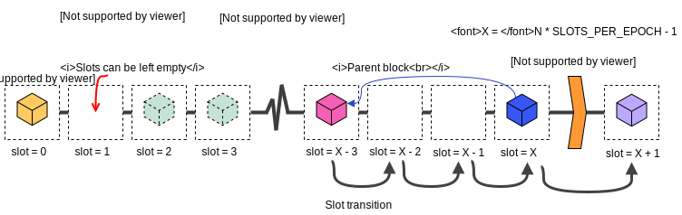
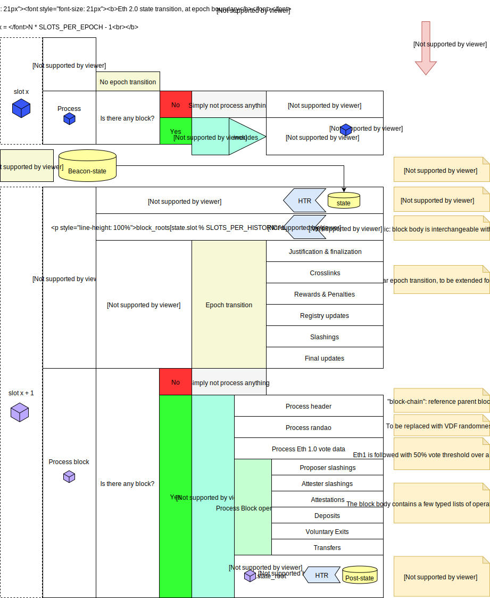
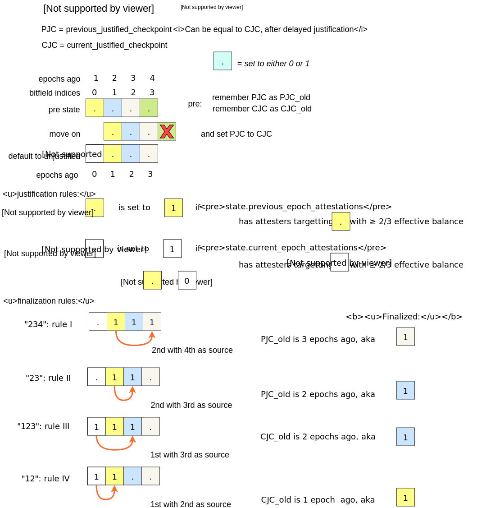
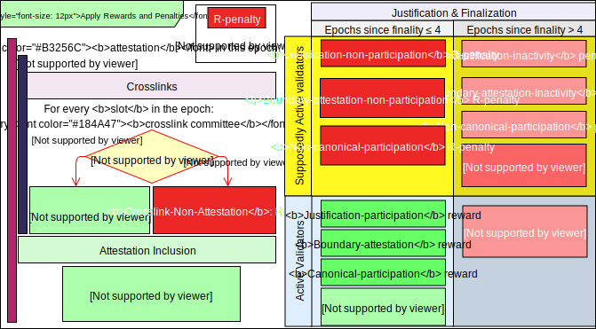
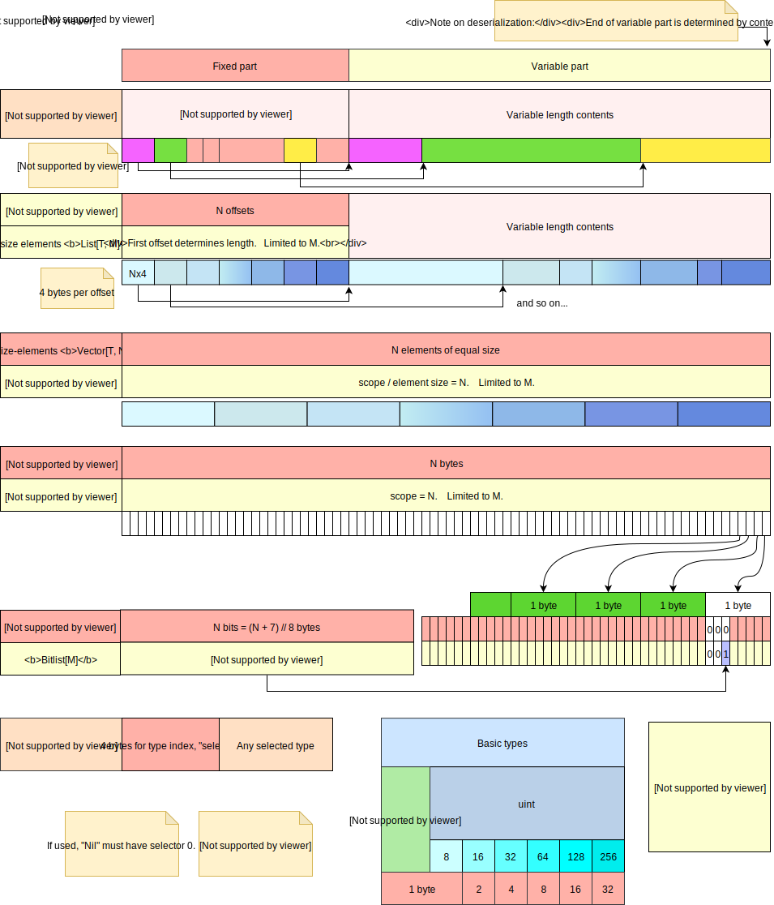
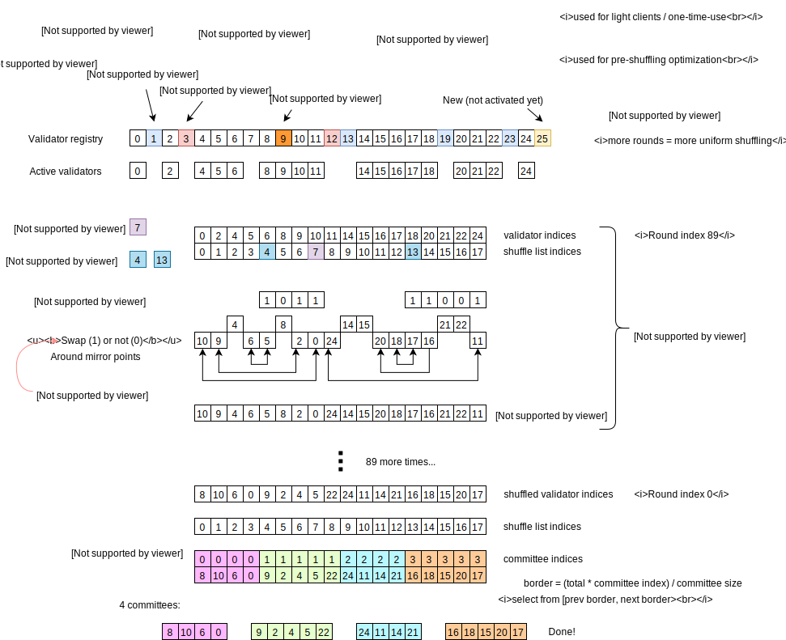

# ETH 2.0 educational resources

*These are unofficial (whatever official means in Ethereum...) documents/diagrams for others to understand the spec better*

The ETH 2.0 spec can be found here: [github.com/ethereum/eth2.0-specs](https://github.com/ethereum/eth2.0-specs]

## Overview

External text resources:

- [Eth 2.0 Design Rationale](https://notes.ethereum.org/s/rkhCgQteN) (main author: Vitalik Buterin)
- Eth 2.0 Accompanying spec resource. *Added soon* (main author: Danny Ryan)
- [The ol' trusty Eth 2.0 Handbook](https://notes.ethereum.org/s/BkSZAJNwX)

Diagrams:

- Basic timeline example: Blocks, Slots and Epochs
- BeaconState transition for Phase-0
- Justification and Finalization
- Rewards and penalties table
- SSZ hash-tree-root and merkleization
- SSZ encoding
- Shuffling

### timeline

### Phase-0 BeaconState transition

### Justification and Finalization

### Rewards and penalties table

### SSZ hash-tree-root and merkleization

### SSZ encoding

### Shuffling

