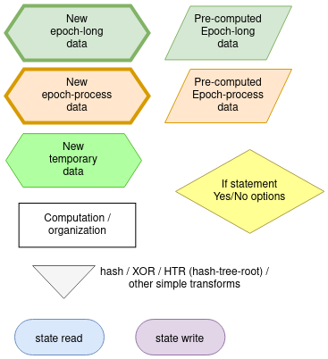
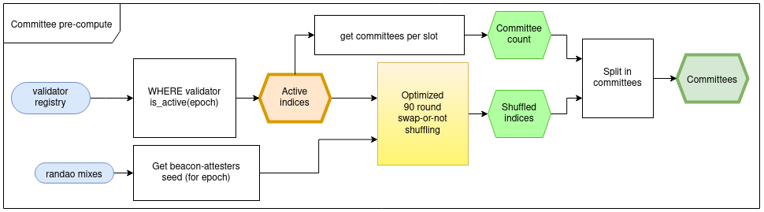
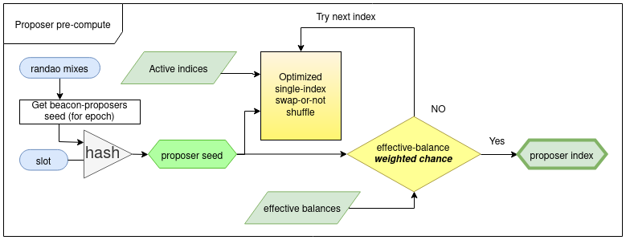
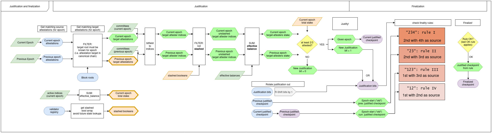
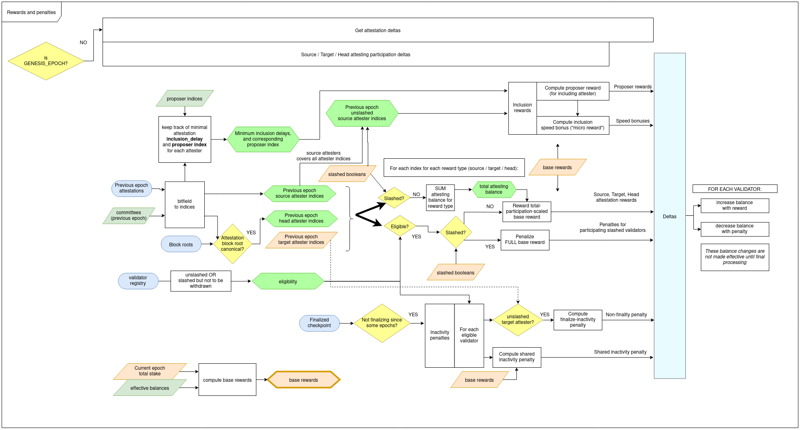
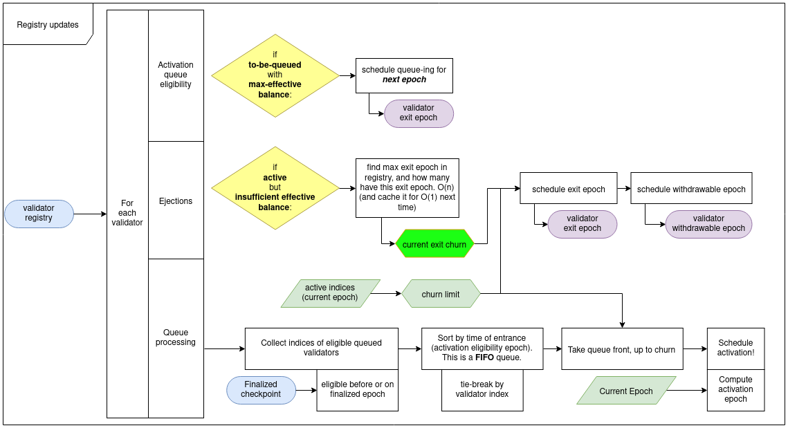
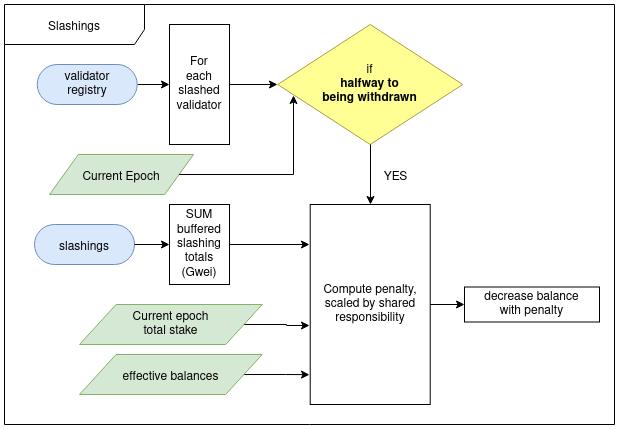
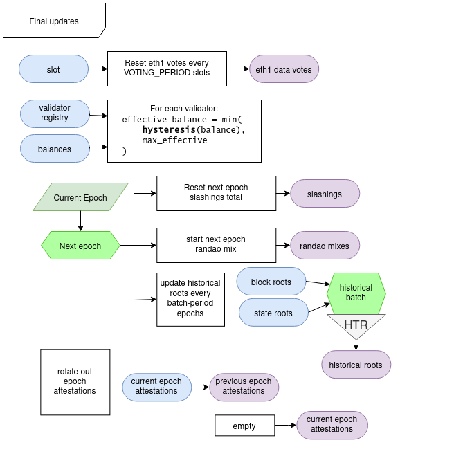

# ETH 2.0 educational resources

*These are unofficial (whatever official means in Ethereum...) documents/diagrams for others to understand the spec better*

The ETH 2.0 spec can be found here: [github.com/ethereum/eth2.0-specs](https://github.com/ethereum/eth2.0-specs)

## Overview

External text resources:

- [Eth 2.0 Design Rationale](https://notes.ethereum.org/s/rkhCgQteN) (main author: Vitalik Buterin)
- Eth 2.0 Accompanying spec resource. *Added soon* (main author: Danny Ryan)
- [The ol' trusty Eth 2.0 Handbook](https://notes.ethereum.org/s/BkSZAJNwX)

Diagrams:

- [Basic timeline example: Blocks, Slots and Epochs](#timeline-concept)
- [BeaconState transition for Phase-0](#phase-0-beaconstate-transition)
- [Justification and Finalization](#justification-and-finalization)
- [Rewards and penalties table](#rewards-and-penalties-table)
- [SSZ hash-tree-root and merkleization](#ssz-hash-tree-root-and-merkleization)
- [SSZ encoding](#ssz-encoding)
- [Shuffling](#shuffling)

### Timeline concept

### Phase-0 BeaconState transition

### Justification and Finalization

### Rewards and penalties table

### SSZ hash-tree-root and merkleization

### SSZ encoding

### Shuffling

#### Epoch processing

This epoch-processing help matches the phase0 beacon-chain behavior of spec v0.10.0.

Note that these diagrams are for the optimized implementation: lots of pre-computation, data in arrays, and flattening of nested spec functions. 

#### Schematic type info

An overview of the box types used in the schematics below. Note the different kinds of pre-computation.

#### Committee pre-computation

Optimization: the [optimized list-wise shuffling algorithm](#shuffling) is used to compute committees data, based on the seed, derived from RANDAO data.
Committee indices wil be joined with bitfields to get participant data, splitting the shuffled array into committee slices is advisable, to not re-compute bounds.

There is a look-ahead, and each epoch will only need to be computed once, for a given seed. (warning: if the chain forks deep enough, the seed for an epoch can change).

#### Proposer pre-computation

Optimization: the proposer indices are pre-computed using the same shuffling algorithm as committees, but only swapping an individual index around to avoid extra hashing. And the seed uses a different domain.

There is a slight chance the proposer has to be re-computed, since we try to favor validators that have a higher effective (capped) balance.

#### Slot transition

Not strictly part of the epoch transition, but essential to run before the actual epoch-transition, to cache the necessary state values (such as latest block root).

#### Justification and finalization

This is a big function, but boils down to repeating similar things for the previous and current epoch.

To speed up the processing, as well as the attester-rewards, it's best to pre-compute arrays of data (matching validator indices), and use those instead of re-processing the attestations (as the spec naively does).
This way, the function can be completely flattened out to a process that dumps attestations into attester statuses, and then sums and filters the attester data a few times to get the FFG numbers.

#### Rewards & Penalties

Similar to justification and finalization, rewards need to process attestations extensively. Go through the attestation, dump the status data that is necessary, and then use this to.

Similarly, further array optimized lookups are:
- Eligbility pre-computed
- When processing attestations and dumping data, remember the minimum inclusion delay, and corresponding proposer index, for each validator.
  The rewarding part will not have to re-visit all attestations (like the spec naively implements).

Also note that the "source" type is a superset of the other types.

However, although theoretically it could be, "target" or "head" may be incorrectly not on the same chain, as these are unverified user-inputs.

Attestations checkpoints for a certain checkpoint type, that cannot be found on the canonical chain (roots in the state), are simply ignored, and as good as inactivity. 

#### Registry updates

Optimization: note that the queing, ejections, and queue processing are all parallel: the validators affected cannot overlap due to their status and scheduling of follow-up actions for next epoch or later.

Optimization: the churn limit can be computed once, based on the active-indices length, also already computed.

Optimization: subsequent exits do not need to completely recompute the next exit-epoch.
The max exit-epoch, and the current queue for it, can be cached. This makes the next call a simple O(1) incremental update on the cached values. 

#### Slashings

Slashed validators get hit with a penalty that is adjusted based on the context: how many other validators are getting slashed?

The total stake to put these slashing amounts into context, is already computed and should be re-used.

#### Final updates

Optimization: recomputing hash-tree-root of state-roots and block-roots is unnecessary; these already are part of the merkle-tree of the state, and should already be cached somewhere.
Hash these together, like a 2 field container of two roots, and it matches the batch root to put back into the state (SSZ summaries in action here).

Optimization: the registry updates can be parallelized cheaply, since the function does not access shared memory concurrently.

