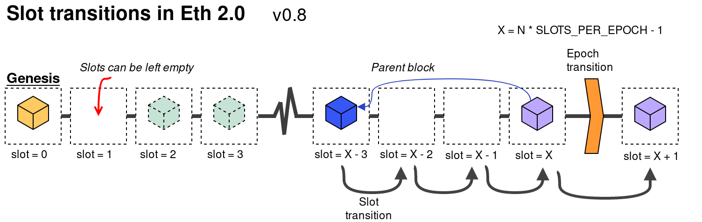
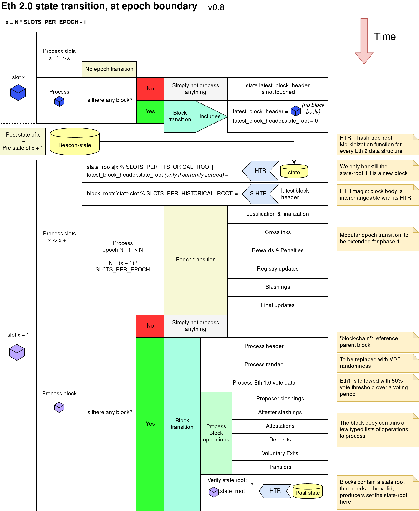
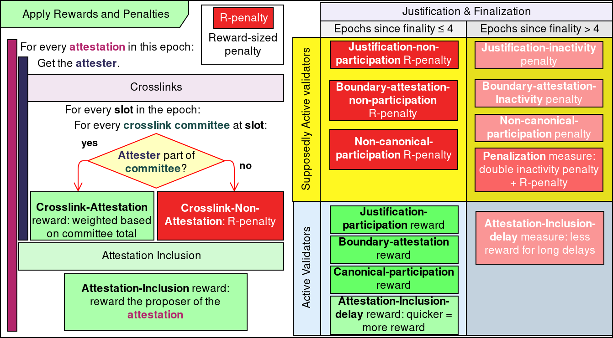
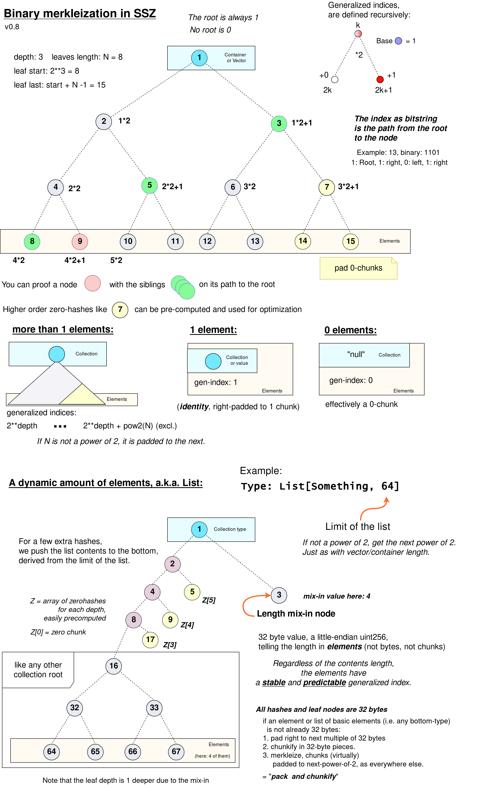
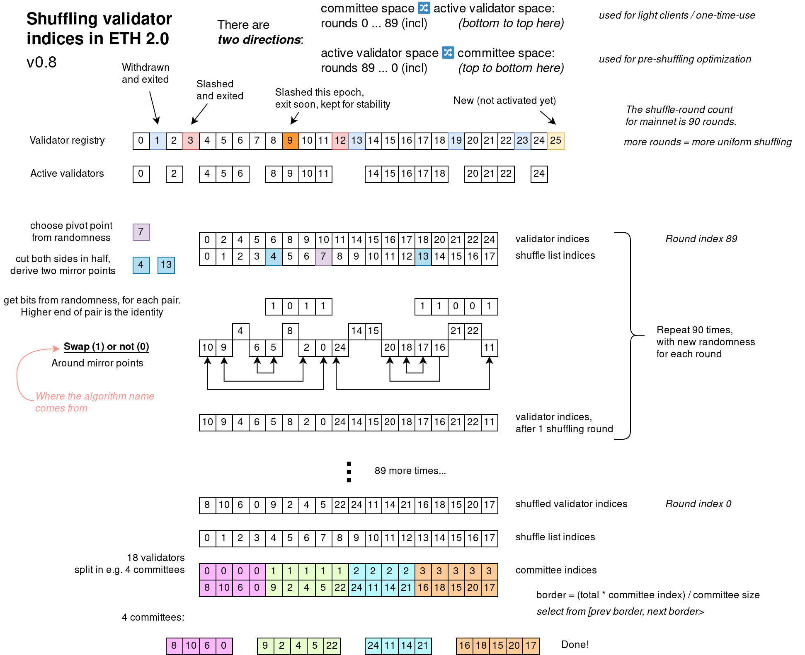

# ETH 2.0 educational resources

*These are unofficial (whatever official means in Ethereum...) documents/diagrams for others to understand the spec better*

The ETH 2.0 spec can be found here: [github.com/ethereum/eth2.0-specs](https://github.com/ethereum/eth2.0-specs)

## Overview

External text resources:

- [Eth 2.0 Design Rationale](https://notes.ethereum.org/s/rkhCgQteN) (main author: Vitalik Buterin)
- Eth 2.0 Accompanying spec resource. *Added soon* (main author: Danny Ryan)
- [The ol' trusty Eth 2.0 Handbook](https://notes.ethereum.org/s/BkSZAJNwX)
- [Two point oh: Newbie friendly explainers](https://our.status.im/tag/two-point-oh)

Diagrams:

- [Basic timeline example: Blocks, Slots and Epochs](#timeline-concept)
- [BeaconState transition for Phase-0](#phase-0-beaconstate-transition)
- [Justification and Finalization](#justification-and-finalization)
- [Rewards and penalties table](#rewards-and-penalties-table)
- [SSZ hash-tree-root and merkleization](#ssz-hash-tree-root-and-merkleization)
- [SSZ encoding](#ssz-encoding)
- [Shuffling](#shuffling)

### Timeline concept

### Phase-0 BeaconState transition

### Justification and Finalization

### Rewards and penalties table

### SSZ hash-tree-root and merkleization

### SSZ encoding

### Shuffling

